# This Project is about building a self driving RC car

From radio controlled Rc car to Self Driving Car:

<b>- Raspberry Pi 3 </b>
 
 
 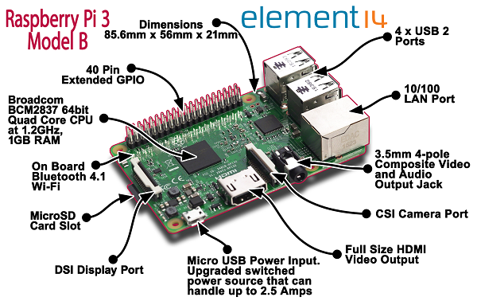

 
 
 
<b>- Accelerometer and Gyroscope <a href="https://www.dfrobot.com/wiki/index.php/6_DOF_Sensor-MPU6050_(SKU:SEN0142)">MPU-6050 DFRobot</a></b>

 
 
 
 
<b>- Camera module </b>

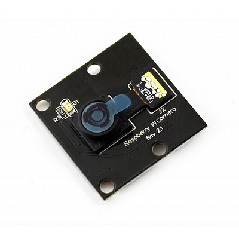

 
<b>- Vibration sensor to detect shocks </b>

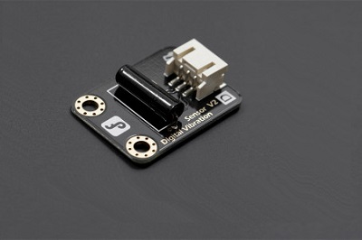

 
<b>- Engine Controllers : L298N H-BRIDGE (double channel)</b>

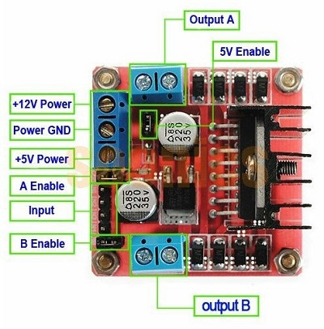
 
 
<b>- Ultrasonic sensors HC-SR04 : 2 - 200 cm </b>

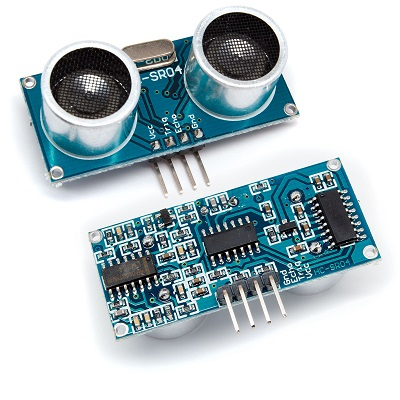

 
<b>- The speakers: 2 x : YD30 0,5W 8Ohm - 15 x 12 mm </b>
 

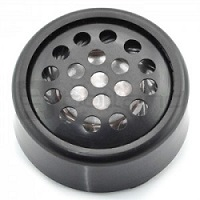

 

 
<b>- 2 NCR-18650B 3400mAh in series + 2 NCR-18650B 3400mAh in series </b>
  
  
Totally 3,6v * 2 = 7,2v , 3400mAh * 2 = 6800 mAh
  
  

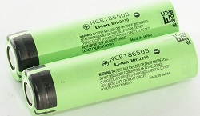 

 
<b>- Power Supply for logic board ( Raspberry Pi 3 ) : LM2596 3,2V-35V 3A</b> 
  
  
( It converts from 7.2 volts to 5v )

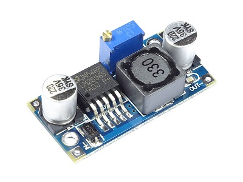 

 

 
<b>- Raspberry radiators:</b>

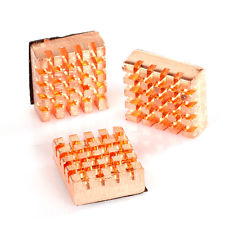 

 
<b>- The car: </b>
  
  

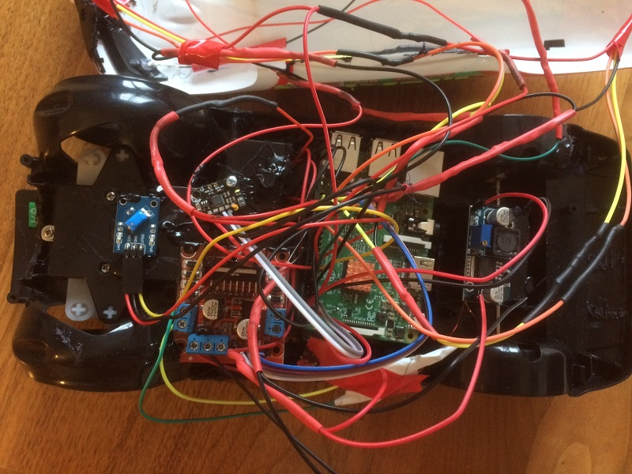 

 
<b>First experiment. Self Braking </b>
  
  

Python scripts that stops the car 30cm before the Obstacle.  

In the future I plan to let the car learn by itself when to start breaking to stop just before the obstacle ( lets say few centimeters )
  
 
<b> ( Click on the image to open Youtube Video )</b>

[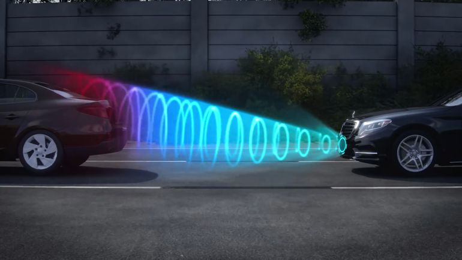](https://www.youtube.com/watch?v=DdvyLE2n-hg)

